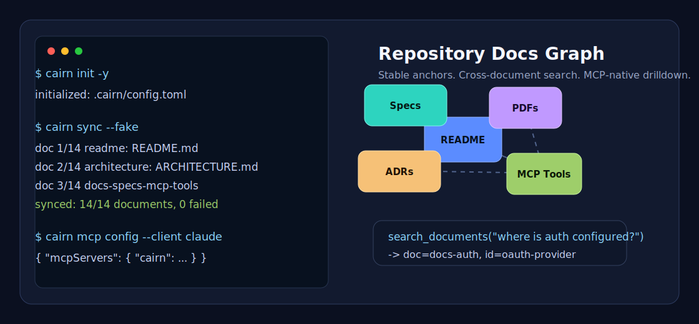

# Cairn

> **Repository documentation graph for AI agents. CodeGraph helps agents
> navigate code; Cairn helps them navigate docs.**

[](https://github.com/jokeuncle/cairn/actions/workflows/ci.yml)
[](LICENSE)
[](CHANGELOG.md)
[](https://www.python.org/)
[](https://modelcontextprotocol.io/)



Cairn is a **local-first, MCP-native documentation graph** for software
repositories and large structured documents. It turns README files, specs,
ADRs, docs folders, PDFs, and optional MarkItDown-converted Office/data/web
files into a navigable map: document catalog, hierarchical sections,
multi-granularity summaries, entity mentions, cross-reference edges, and a
semantic vector overlay.

Instead of dumping whole docs into context or relying on anonymous chunks, an
agent can ask Cairn to `list_documents`, `search_documents`, inspect an
`outline`, and drill into exact sections with stable `cairn://` anchors. The
same engine also works for standalone handbooks, papers, and PDFs.

The result: better retrieval accuracy, lower token spend, and a practical MCP
tool layer between your project documentation and every AI coding agent you
use. Local-first. Vendor-neutral. Designed for open-source repos.

> 🚀 **Alpha — `0.1.0a2`.** Markdown + PDF ingest, all eight MCP tools,
> the full structure-aware index (tree + summaries + entities + xrefs +
> vectors), repo-level `init/sync/status`, repo-scoped MCP with
> `list_documents` + `search_documents`, failure-isolated sync, static graph
> inspector, Doubao multimodal embeddings, and a benchmark harness with
> headline numbers. See [`CHANGELOG.md`](CHANGELOG.md) for what's in this
> release and [`ROADMAP.md`](ROADMAP.md) for what's next.

---

## Why Cairn?

| Today | With Cairn |
|---|---|
| AI coding agents guess from README snippets or grep. | Agent gets a repo-level documentation map with stable section anchors. |
| Dump the whole document into context. Burns tokens, dilutes attention. | Agent fetches only what it needs, at the granularity it needs. |
| Naive RAG splits structure into context-free chunks. | The document's own structure is the index. |
| Cross-references and entities are lost in chunking. | They are first-class objects. |
| Locked into one vendor's embeddings / vector DB. | Pluggable everything. Local-first defaults. |
| Different tool stacks for Claude / Cursor / Cline / Goose. | One MCP server. Any compliant agent works. |

For the in-depth motivation, see [`PRODUCT.md`](PRODUCT.md).
For the technical design, see [`ARCHITECTURE.md`](ARCHITECTURE.md).

---

## How It Works (90 seconds)

1. **Discover.** `cairn init -y` writes `.cairn/config.toml`; `cairn sync`
   discovers README, Markdown docs, ADRs, specs, and PDFs from conservative
   repo globs.
2. **Index.** Each document becomes a normal Cairn index: structural tree (T),
   multi-level summaries (S), entity index (E), cross-reference graph (X), and
   vector overlay (V). A bad source file is isolated instead of breaking the
   whole repo sync.
3. **Serve.** `cairn serve` exposes repo-scoped MCP tools:
   `list_documents`, `search_documents`, plus `outline`, `get_section`,
   `expand`, `search_semantic`, `search_keyword`, `find_mentions`,
   `get_related`, and `read_range` routed by optional `doc`.
4. **Navigate.** Your agent searches across the repo, picks a document, drills
   into promising sections, and only fetches full text when justified. Every
   result carries stable anchors for verification.

A visual explainer comparing Cairn's approach to RAPTOR, BookRAG, and A-RAG
lives at [`docs/canvas.html`](docs/canvas.html). Open it in any browser.

---

## Quickstart

The fastest way to see Cairn work is to index this repo's own documentation.
**Zero API keys, zero model downloads** — the `--fake` flag uses deterministic
in-process plugins so the whole thing runs offline.

The PyPI distribution is `cairn-docs`; the CLI command is `cairn`:

```bash
pip install cairn-docs
```

Or run it without installing:

```bash
uvx --from cairn-docs cairn --help
```

### Repository Workflow

Inside any repository:

```bash
cairn init -y
cairn sync --fake
cairn status
cairn doctor
cairn mcp config --client claude --fake
cairn serve --fake
```

`cairn doctor` checks repo config, index freshness, primary-doc routing, and
model settings. `cairn mcp config` prints copy-pasteable stdio snippets for
Claude, Cursor, Codex, and Goose:

```bash
cairn mcp config --client claude
cairn mcp config --client cursor
cairn mcp config --client codex
cairn mcp config --client goose
```

For local development from source:

```bash
git clone https://github.com/jokeuncle/cairn.git
cd cairn

python3.11 -m venv .venv
.venv/bin/pip install -e ".[dev]"

# 1. Create .cairn/config.toml with conservative documentation globs.
.venv/bin/cairn init -y

# 2. Index README, Markdown docs, and PDFs.
.venv/bin/cairn sync --fake

# 3. Inspect freshness and indexed document ids.
.venv/bin/cairn status

# 4. Start the repo-scoped MCP stdio server for Claude Code / Cursor / Cline / Goose.
.venv/bin/cairn serve --fake
```

Repo mode writes a shareable config plus ignored runtime data:

```text
.cairn/
  config.toml       # commit this if you want a stable repo docs policy
  manifest.json     # generated
  documents/        # generated per-document Cairn indexes
    readme/
    architecture/
    docs-specs-mcp-tools/
```

Repo-scoped MCP adds:

| Tool | Use it for |
|---|---|
| `list_documents` | See every indexed doc, its source path, freshness, and section count. |
| `search_documents` | Search across all indexed docs and get globally ranked section hits with `doc` ids. |
| normal Cairn tools + `doc` | Drill into a chosen document with `outline`, `get_section`, `search_semantic`, `get_related`, etc. |

Repo behavior is intentionally configurable in `.cairn/config.toml`:

| Setting | Default | Impact |
|---|---|---|
| `include` | README, top-level Markdown/PDF, `docs/**` Markdown/PDF, one-level nested README | Expands or narrows what Cairn treats as repository documentation. Broader globs improve coverage but can index noisy generated files. |
| `exclude` | `.git`, `.cairn`, `.codegraph`, caches, virtualenvs, build output, `node_modules` | Keeps generated or tool-owned docs out of search. Simple `name/**` directory excludes match at any depth, so `frontend/node_modules/...` and `apps/web/dist/...` are skipped. Add project-specific generated doc folders here. |
| `enable_markitdown` | `false` | Enables non-Markdown/PDF conversion when the `markitdown` extra is installed. Useful for DOCX/PPTX/XLSX/HTML-heavy repos, slower and less deterministic than native Markdown/PDF parsing. |
| `primary_doc` | `readme` | Chooses the default document for normal tools when `doc` is omitted in repo mode. |
| `search_sections_per_doc` | `1` | Default diversity for `search_documents`. `1` helps agents find the right doc first; raise it when a repo has a few long docs and you want deeper hits from each doc by default. |

MarkItDown integration is local-file only and optional. Cairn uses it as a
conversion layer, then feeds the generated Markdown into the same canonical
Markdown parser. This expands coverage to formats such as DOCX, PPTX, XLSX,
HTML, CSV, JSON, XML, and EPUB without making the base install heavy:

```bash
.venv/bin/pip install -e ".[markitdown]"
.venv/bin/cairn init -y --force --markitdown
.venv/bin/cairn sync --fake
```

Generate a standalone graph inspector for the primary repo doc:

```bash
cairn inspect --out /tmp/cairn-repo-inspector.html
```

### Single Document Workflow

Cairn still works as a focused index for one large document:

```bash
# Index Cairn's own architecture document.
.venv/bin/cairn index ARCHITECTURE.md --out /tmp/cairn-arch --fake

# Get the map — gists only, never full text.
.venv/bin/cairn outline /tmp/cairn-arch --depth 2

# Keyword search: every section that mentions "LanceDB".
.venv/bin/cairn query keyword /tmp/cairn-arch LanceDB

# Multi-term keyword search with mode=all.
.venv/bin/cairn query keyword /tmp/cairn-arch progressive disclosure --mode all

# Generate a standalone graph inspector for the built index.
.venv/bin/cairn inspect /tmp/cairn-arch --out /tmp/cairn-arch/inspector.html

# Start a single-document MCP stdio server.
.venv/bin/cairn serve /tmp/cairn-arch --fake
```

A walkthrough with full output and an MCP-client config snippet is in
[`examples/hero-demo.md`](examples/hero-demo.md).

### Benchmarks

Cairn ships with `cairn-bench`, a small framework that compares Cairn against
a naive 512-word-chunk vector-RAG baseline (both backed by LanceDB and the
same embedder, so the comparison is apples-to-apples).

Running the starter suite (10 hand-curated questions over Cairn's own
`ARCHITECTURE.md`) with deterministic in-process plugins:

```bash
cairn bench benchmarks/architecture.toml --fake
```

| metric | naive vector RAG | Cairn |
|---|---:|---:|
| mean recall@8 | 25% | 25% |
| mean tokens returned | 3,670 | **1,388 (37.8% of naive)** |

Caveat — these numbers come from the deterministic `FakeEmbedder` (a
bag-of-words hash with no semantic understanding). Recall ties because
neither system has semantics; **the 2.6× token efficiency win is independent
of the embedder**: it comes from progressive disclosure and section-aware
retrieval, not from vector quality. Cairn now returns a short `evidence`
snippet with every semantic hit by default, which raises the token count but
makes ranking errors easier to inspect. Reproduce these numbers in under a
second on any machine — and re-run with Ollama (`nomic-embed-text`) or
Doubao for the real-semantics version. See
[`benchmarks/README.md`](benchmarks/README.md) for caveats and how to author
your own suites.

Repo-level smoke tests are also public and reproducible:

```bash
python scripts/eval_repos.py --repo all --refresh
python scripts/smoke_many_repos.py --limit 32
```

The labeled eval set covers `astral-sh/uv`, `pydantic/pydantic-ai`,
`modelcontextprotocol/python-sdk`, and `fastapi/full-stack-fastapi-template`.
The broad smoke matrix currently spans 32 public repositories across Python,
JavaScript/TypeScript, Rust, and Go ecosystems. It is not an accuracy
leaderboard; it verifies clone/discovery/sync/search/drilldown robustness and
latency across different documentation shapes.

Latest fake-plugin runs on this machine:

| suite | result |
|---|---|
| `pydantic-ai` labeled eval | 178/178 docs indexed, 8/8 top1, 8/8 top5, 8/8 drilldown |
| `uv` labeled eval | 89/89 docs indexed, 15/16 top1, 16/16 top3/top5, 16/16 drilldown |
| `mcp-python-sdk` labeled eval | 17/17 docs indexed, 4/4 top1, 4/4 drilldown |
| `fastapi-template` labeled eval | 7/7 docs indexed, 4/4 top1, 4/4 drilldown |
| 32-repo smoke matrix | 1076 docs indexed, 0 sync failures, 160/160 searches with hits, 160/160 drilldowns |

`search_documents` uses a general hybrid ranker: dense vector similarity,
BM25-style sparse evidence, structure-aware field support, weighted query-term
coverage, path/title identity prior, and local graph-neighborhood propagation.
The ranker does not special-case repository names, document ids, or benchmark
answers.

### Real LLM + real embeddings

The `--fake` plugins are great for offline reproducibility but they have no
semantic understanding. For production indexing, point Cairn at any
OpenAI-compatible endpoint. The defaults target a **local Ollama** so you
keep the local-first promise without paying for API tokens:

```bash
ollama serve
ollama pull llama3.2:3b
ollama pull nomic-embed-text

.venv/bin/cairn index ARCHITECTURE.md --out /tmp/cairn-arch   # no --fake
```

OpenAI, vLLM, Together, Anyscale, …all of them work the same way; override
`CAIRN_LLM_*` and `CAIRN_EMBED_*` environment variables.

For Doubao's vision embedding model, use the dedicated provider because the
model is served through Volcengine's `/embeddings/multimodal` endpoint:

```bash
export CAIRN_LLM_BASE_URL=https://ark.cn-beijing.volces.com/api/v3
export CAIRN_LLM_MODEL=doubao-seed-2-0-code-preview-260215
export CAIRN_LLM_API_KEY=...

export CAIRN_EMBED_PROVIDER=doubao-vision
export CAIRN_EMBED_API_KEY=...

cairn index ARCHITECTURE.md --out /tmp/cairn-arch
```

Useful operational knobs when running against hosted APIs:

| variable | default | purpose |
|---|---:|---|
| `CAIRN_LLM_TIMEOUT` | `60` | per-request summary timeout in seconds |
| `CAIRN_LLM_MAX_RETRIES` | `2` | retries for 429/5xx and transport errors |
| `CAIRN_EMBED_TIMEOUT` | `60` | per-request embedding timeout in seconds |
| `CAIRN_EMBED_MAX_RETRIES` | `2` | retries for embedding 429/5xx and transport errors |
| `CAIRN_SUMMARY_CONCURRENCY` | `4` | concurrent summary calls during indexing and benchmarks |
| `CAIRN_EMBED_BATCH_SIZE` | `32` | sections/chunks per embedding batch |

---

## Inspiration and Lineage

Cairn synthesizes two strands of recent research and ships them as a real,
agent-ready tool:

- **[BookRAG](https://arxiv.org/abs/2512.03413)** (Dec 2025): structure-aware
  index combining a hierarchical tree with an entity graph, queried via an
  Information-Foraging-Theory-inspired agent. Cairn implements this vision in
  production-grade form.
- **[A-RAG](https://arxiv.org/abs/2602.03442)** (Feb 2026): clean agent loop
  with hierarchical retrieval tools (keyword/semantic/chunk). Cairn borrows the
  agent-tool philosophy and replaces A-RAG's chunk-based index with a
  structure-first one.
- **[RAPTOR](https://arxiv.org/abs/2401.18059)** (ICLR 2024): the seminal
  recursive-summarization tree. Cairn's summary layer takes inspiration from it
  while anchoring summaries to the document's own structure instead of
  clustered chunks.

We are deeply grateful to these authors; see ADRs for the specific design
choices we adopted, modified, or declined.

---

## Status & Roadmap

| Phase | Status | What |
|---|---|---|
| 0 — Foundation | ☑ | Authoritative docs in place (PRODUCT, ARCHITECTURE, CLAUDE, ROADMAP, ADR-0001) |
| 1 — v0.1 walking skeleton | ☑ | Markdown ingest, Tree + Summaries + Vectors indexes, 5 MCP tools, stdio server, CLI, hero demo |
| 2 — v0.2 structure-aware retrieval | ☑ | Entities, cross-references, PDF ingest, digest summaries, incremental rebuild, static inspector, `cairn-bench` |
| 3 — v0.3 repo docs graph | ◐ | Repo `init/sync/status`, repo-scoped MCP, `list_documents`, `search_documents`, shareable `.cairn/config.toml`; hosted inspector and telemetry still next |
| 4 — v0.4 polish for production | ☐ | DOCX/RTF/EPUB, VSCode extension, security review |
| v1.0 GA | ☐ | All `PRODUCT.md` §7 success criteria met |

Full plan: [`ROADMAP.md`](ROADMAP.md). Current test suite: **409 passing**,
mypy strict clean, ruff clean.

Maintainer release gate: [`docs/release-checklist.md`](docs/release-checklist.md).

---

## Contributing

Cairn is opinionated. Before opening a PR, please read:

1. [`PRODUCT.md`](PRODUCT.md) — especially the non-goals.
2. [`ARCHITECTURE.md`](ARCHITECTURE.md) — the end-state design we're building toward.
3. [`CONTRIBUTING.md`](CONTRIBUTING.md) — workflow and PR expectations.
4. [`docs/decisions/`](docs/decisions/) — existing ADRs.

If you're an AI agent helping a contributor, you'll find your session anchor in
[`CLAUDE.md`](CLAUDE.md).

---

## License

Apache 2.0. See [`LICENSE`](LICENSE).

---

*A cairn is a small stack of stones marking a trail through difficult terrain.
This project is one for AI agents lost in large documents.*
