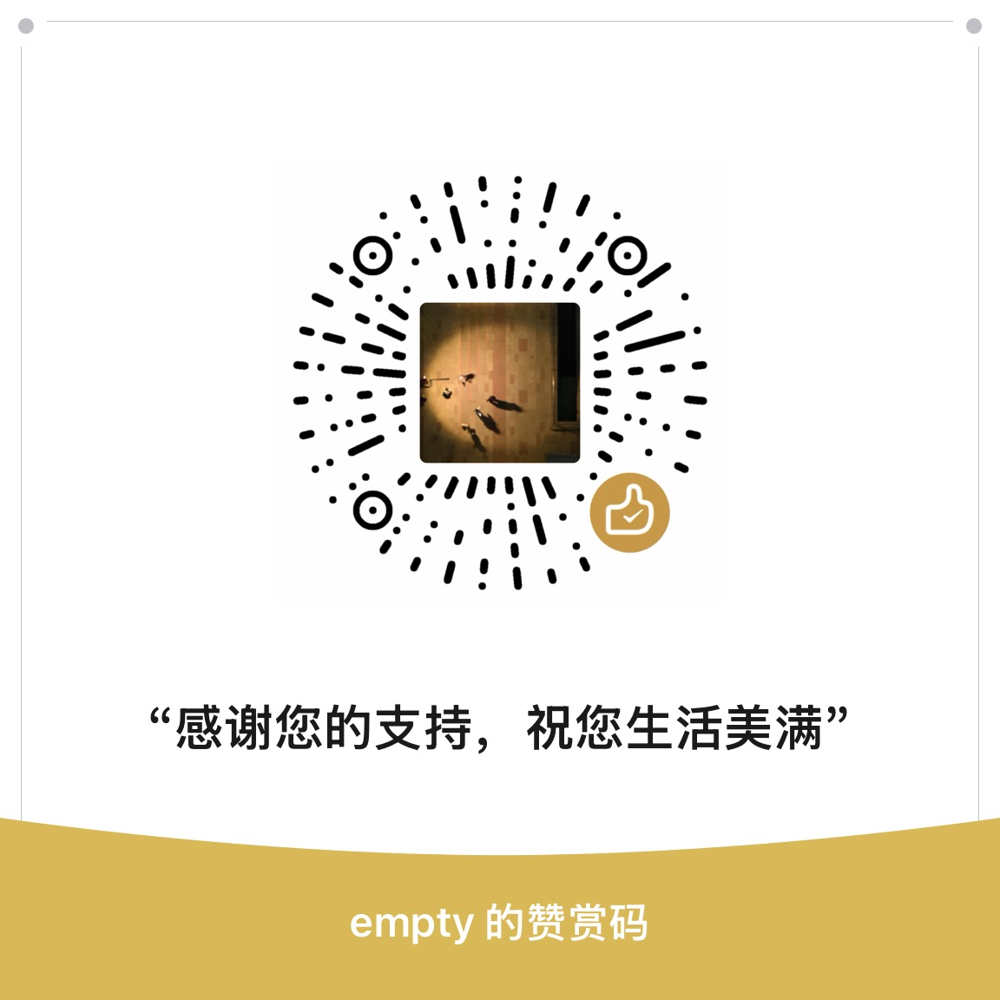

# Support

Cairn is an alpha-stage open-source project published as the `docsgraph`
Python package.

## Questions and Usage Help

Start with the public docs:

- Product website: https://jokeuncle.github.io/cairn/
- README quickstart: `README.md`
- Release checklist: `docs/release-checklist.md`
- MCP tool specification: `docs/specs/mcp-tools.md`

If the docs do not answer your question, open a GitHub discussion or issue with
the command you ran, the version from `docsgraph version`, and the relevant
repository or document shape.

## Support Maintenance

Cairn is Apache-2.0 and free to use. If it saves you time, sponsorship is
welcome and helps fund maintenance, release automation, documentation, and
agent integrations.

Use the GitHub Sponsor button when available, or scan the WeChat reward code:

  

## Bugs

Use the bug report issue template. A useful report includes:

- `docsgraph version`
- Python version and operating system
- the smallest document or repository setup that reproduces the issue
- the exact command and output

## Security

Do not open public issues for vulnerabilities. Follow `SECURITY.md` and use
GitHub private vulnerability reporting for this repository.

## Scope

Maintainers prioritize issues that affect the documented CLI, MCP tools,
indexing behavior, packaging, and release workflow. Feature requests that change
product scope, MCP tool contracts, on-disk formats, or major dependencies should
include or link an ADR proposal.
